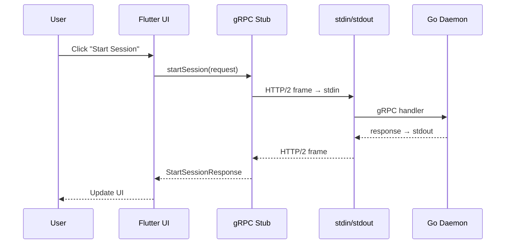

# Godart Apps — Embedding a Go Daemon in a Flutter Application

> *Recipe: how we integrate a Go gRPC daemon into a Flutter (Dart)
> application — desktop and mobile.*

## Overview

A **Godart app** is a Flutter application that ships with an embedded Go
component. The Go code acts as a **headless daemon** exposing its entire
API via gRPC. The Flutter UI never calls Go code directly: all
communication goes through Protocol Buffers over an HTTP/2 channel.

The integration strategy differs by platform:

- **Desktop** (macOS, Linux, Windows): the Go daemon is a standalone
  binary launched as a child process, communicating via `stdio://` pipes.
- **Mobile** (iOS, Android): the Go daemon is compiled as a C shared
  library, loaded in-process via `dart:ffi`, communicating via `unix://`
  domain sockets inside the app sandbox.

The pattern yields two independent holons that can be developed, tested,
and versioned separately:

| Holon | Language | Role |
|-------|----------|------|
| **Daemon** | Go | gRPC server — all business logic |
| **Godart** | Dart / Flutter | Desktop UI client — presentation only |

```
┌─────────────────────────────────────────────────────┐
│  godart_app.app                                     │
│                                                     │
│  ┌──────────┐   stdio://   ┌─────────────────────┐  │
│  │ Flutter  │   (pipes)    │ daemon binary       │  │
│  │ UI + gRPC│◄────────────►│ serve --listen stdio│  │
│  │ client   │              │ (Go, bundled)       │  │
│  └──────────┘              └─────────────────────┘  │
│                                                     │
│  macOS: Contents/Resources/daemon                   │
└─────────────────────────────────────────────────────┘
```

---

## 1. The Shared Contract: Protobuf

The **daemon holon owns the proto files**. The Godart holon does not
copy or symlink them — it references the daemon's `protos/` directory at
`protoc` generation time via the `-I` (include path) flag.

### 1.1 Directory layout

```
holons/
├── my-daemon/
│   └── protos/
│       └── myservice/v1/service.proto    ← source of truth
└── my-godart/
    ├── protos/
    │   └── godart/v1/godart.proto        ← Godart-only services (optional)
    └── lib/gen/                          ← generated Dart stubs
```

The single proto file is the **only coupling** between the two holons.
Neither depends on source code from the other.

### 1.2 Generating stubs

```bash
# Go stubs (in the daemon holon)
cd holons/my-daemon
protoc --go_out=. --go-grpc_out=. protos/myservice/v1/service.proto

# Dart stubs (in the Godart holon, referencing the daemon's protos via -I)
cd holons/my-godart
protoc \
  -I../../my-daemon/protos \
  --dart_out=grpc:lib/gen/myservice/v1 \
  myservice/v1/service.proto
```

The `-I../../my-daemon/protos` flag tells `protoc` where to find the
daemon's `.proto` files. No symlinks, no copies — just a relative path.

### 1.3 Godart-specific protos (optional)

The Godart holon can define its own `.proto` files for services
implemented only in Dart (not by the Go daemon). These can `import`
types from the daemon's protos:

```protobuf
// protos/godart/v1/godart.proto
syntax = "proto3";
package godart.v1;

import "myservice/v1/service.proto";  // resolved via -I

// Dart-only services (e.g., file browsing, UI sync)
```

Generate with both include paths:

```bash
protoc \
  -I../../my-daemon/protos \
  -Iprotos \
  --dart_out=grpc:lib/gen/godart/v1 \
  godart/v1/godart.proto
```

---

## 2. The Go Daemon

### 2.1 Serving with transport URI

Every Go daemon uses the canonical `serve` package from `go-holons`:

```go
case "serve":
    listenURI := serve.ParseFlags(os.Args[2:])
    if strings.TrimSpace(listenURI) == "" {
        listenURI = "tcp://:9091"
    }

    svc := server.New()
    if err := serve.Run(listenURI, func(gs *grpc.Server) {
        pb.RegisterMyServiceServer(gs, svc)
    }); err != nil {
        fmt.Fprintf(os.Stderr, "serve error: %v\n", err)
        os.Exit(1)
    }
```

The `--listen` flag accepts any transport URI from the organic
programming transport layer:

| URI | Transport |
|-----|-----------|
| `tcp://:9091` | Standard TCP socket |
| `unix:///tmp/daemon.sock` | Unix domain socket |
| `stdio://` | stdin/stdout pipes (HTTP/2 over process pipes) |
| `mem://` | In-process channel (for Go-to-Go compositing) |

When the Godart app spawns the daemon, it always passes
`serve --listen stdio://`.

### 2.2 Bridge package (for Go-to-Go compositing)

A `pkg/<name>/` bridge package exposes a single `Register` function
so other Go holons can embed the daemon in-process via `mem://`:

```go
// Package myservice exposes MyService for in-process (mem://) compositing.
package myservice

import (
    pb "example.com/daemon/gen/go/myservice/v1"
    "example.com/daemon/internal/server"
    "google.golang.org/grpc"
)

func Register(gs *grpc.Server) {
    pb.RegisterMyServiceServer(gs, server.New())
}
```

This is not used by the Godart app (which uses `stdio://`), but it keeps
the daemon composable with other Go holons.

---

## 3. The stdio:// Transport — The Key Mechanism

The entire integration hinges on **gRPC over process pipes**. This is
standard HTTP/2 framing — no custom protocol.

### Server side (Go)

`serve.Run("stdio://", ...)` creates a `net.Listener` that accepts
exactly one connection routed through `os.Stdin` / `os.Stdout`. The
daemon writes all gRPC frames to stdout and reads requests from stdin.
Diagnostic logs go to **stderr**, which the Flutter app captures
separately.

### Client side (Dart)

The `dart-holons` SDK provides `dialStdio()`:

```dart
/// Spawn a holon binary and return a gRPC channel backed by
/// its stdio pipes.
Future<(ClientTransportConnectorChannel, Process)> dialStdio(
  String binaryPath, {
  List<String>? args,
  ChannelOptions options = const ChannelOptions(
    credentials: ChannelCredentials.insecure(),
    idleTimeout: null, // pipes are single-use, never idle-out
  ),
}) async {
  final connector = await StdioTransportConnector.spawn(
    binaryPath,
    args: args ?? const ['serve', '--listen', 'stdio://'],
  );
  final channel =
      ClientTransportConnectorChannel(connector, options: options);
  return (channel, connector.process);
}
```

`StdioTransportConnector` spawns the Go binary as a child process and
creates an HTTP/2 `ClientTransportConnection` backed by the process's
`stdout` (server → client) and `stdin` (client → server):

```dart
class StdioTransportConnector implements ClientTransportConnector {
  final Process _process;
  ClientTransportConnection? _cachedConnection;

  @override
  Future<ClientTransportConnection> connect() async {
    // stdout is single-subscription: cache the connection (sync.Once pattern)
    _cachedConnection ??= ClientTransportConnection.viaStreams(
      _process.stdout,
      _process.stdin,
    );
    return _cachedConnection!;
  }

  @override
  void shutdown() {
    _process.kill(ProcessSignal.sigterm);
  }
}
```

Key design constraint: process pipes are **single-subscription streams**.
The connector caches the transport connection and returns the same
instance on every call to `connect()`, mirroring Go's `sync.Once`
pattern.

---

## 4. The Godart App

### 4.1 DaemonLauncher — Process lifecycle

A dedicated `DaemonLauncher` class manages starting and stopping the
embedded daemon:

```dart
class DaemonLauncher {
  ClientTransportConnectorChannel? _channel;
  Process? _process;

  bool get isRunning => _process != null;

  Future<ClientTransportConnectorChannel> start(String binaryPath) async {
    await stop();

    final file = File(binaryPath);
    if (!file.existsSync()) {
      throw StateError('Daemon binary not found: $binaryPath');
    }

    final (channel, process) = await dialStdio(binaryPath);
    _channel = channel;
    _process = process;

    // Forward daemon stderr to debug console
    process.stderr
        .transform(const SystemEncoding().decoder)
        .listen((line) => stderr.write('[daemon] $line'));

    return channel;
  }

  Future<void> stop() async {
    final channel = _channel;
    final process = _process;
    _channel = null;
    _process = null;

    if (channel != null) await channel.shutdown();
    if (process != null) {
      process.kill(ProcessSignal.sigterm);
      await process.exitCode.timeout(
        const Duration(seconds: 5),
        onTimeout: () {
          process.kill(ProcessSignal.sigkill);
          return -1;
        },
      );
    }
  }
}
```

Shutdown follows a **graceful → forced** escalation:

1. `channel.shutdown()` → calls `StdioTransportConnector.shutdown()` →
   sends `SIGTERM` to the daemon process
2. On the Go side, `serve.RunWithOptions()` traps `SIGTERM` via
   `signal.Notify()` and calls `grpc.Server.GracefulStop()` — draining
   in-flight RPCs cleanly
3. If draining exceeds **10 seconds**, Go calls `grpc.Server.Stop()`
   (force stop)
4. If the Dart side's 5-second `exitCode` timeout expires before Go
   exits, Dart escalates to `SIGKILL`

#### Platform behavior

| Platform | `process.kill(SIGTERM)` | Go receives | Graceful? |
|----------|------------------------|-------------|----------|
| macOS / Linux | Real POSIX SIGTERM | `signal.Notify` fires → `GracefulStop()` | ✅ |
| Windows | `GenerateConsoleCtrlEvent(CTRL_BREAK)` | `signal.Notify` fires → `GracefulStop()` | ✅ |

On Windows, Go's runtime translates `CTRL_BREAK_EVENT` into
`syscall.SIGTERM` for `signal.Notify`, so the exact same graceful
shutdown path executes on all desktop platforms.

### 4.2 Service client — Transport abstraction

The gRPC client class supports all three connection modes transparently:

```dart
class ServiceClient {
  ClientChannel? _channel;
  MyServiceClient? _stub;
  final DaemonLauncher _launcher = DaemonLauncher();

  /// Embedded mode: spawn the bundled daemon
  Future<void> connectEmbedded(String binaryPath) async {
    await close();
    final channel = await _launcher.start(binaryPath);
    _stub = MyServiceClient(channel);
  }

  /// External mode: connect to tcp:// or unix://
  Future<void> connect(String address) async {
    await close();
    final parsed = parseUri(address);
    switch (parsed.scheme) {
      case 'unix':
        _channel = ClientChannel(
          InternetAddress(parsed.path!, type: InternetAddressType.unix),
          port: 0,
          options: const ChannelOptions(
            credentials: ChannelCredentials.insecure(),
          ),
        );
      case 'tcp':
        _channel = ClientChannel(
          parsed.host!, port: parsed.port!,
          options: const ChannelOptions(
            credentials: ChannelCredentials.insecure(),
          ),
        );
    }
    _stub = MyServiceClient(_channel!);
  }

  /// Connectivity check: use a lightweight RPC
  Future<bool> ping() async {
    try {
      await _stub!.getSession(GetSessionRequest(sessionId: ''));
      return true;
    } on GrpcError catch (e) {
      // Reachable if the daemon returns NOT_FOUND or INVALID_ARGUMENT
      if (e.code == StatusCode.notFound ||
          e.code == StatusCode.invalidArgument) return true;
      return false;
    }
  }
}
```

### 4.3 AppState — Connection dispatch

The application state dispatches `stdio://` addresses to the embedded
launcher and everything else to the external client:

```dart
Future<void> connectDaemon(String address) async {
  final target = address.trim();
  final client = ServiceClient();

  if (target.startsWith('stdio://')) {
    final binaryPath = target.substring('stdio://'.length);
    await client.connectEmbedded(binaryPath);
  } else {
    await client.connect(target);
  }

  final ok = await client.ping();
  if (!ok) {
    await client.close();
    throw StateError('Unable to reach daemon at $target');
  }
}
```

The user can switch between modes at runtime (e.g., pointing to an
external `tcp://` daemon for debugging) without restarting the app.

---

## 5. Building and Bundling

### 5.1 Go daemon — cross-compilation

Go cross-compiles cleanly for all platforms from any host:

```bash
# macOS (native or CI)
go build -o build/daemon ./cmd/daemon

# Linux
GOOS=linux GOARCH=amd64 go build -o build/daemon-linux ./cmd/daemon

# Windows
GOOS=windows GOARCH=amd64 go build -o build/daemon.exe ./cmd/daemon

# iOS (c-shared)
CGO_ENABLED=1 GOOS=ios GOARCH=arm64 \
  go build -buildmode=c-shared -o build/libdaemon.dylib ./cmd/daemon

# Android (c-shared)
CGO_ENABLED=1 GOOS=android GOARCH=arm64 \
  go build -buildmode=c-shared -o build/libdaemon.so ./cmd/daemon
```

### 5.2 Build script

A shell script cross-compiles the Go daemon from the sibling holon:

```bash
#!/bin/bash
# Build the daemon binary for bundling in the Flutter app.
set -euo pipefail

SCRIPT_DIR="$(cd "$(dirname "$0")" && pwd)"
DAEMON_SRC="$(cd "${SCRIPT_DIR}/../../my-daemon" && pwd)"
OUTPUT_DIR="${1:-${SCRIPT_DIR}/../build}"

GO="$(command -v go)"
mkdir -p "$OUTPUT_DIR"

echo "Building daemon for $(${GO} env GOOS)/$(${GO} env GOARCH)..."
"${GO}" build -C "$DAEMON_SRC" -o "${OUTPUT_DIR}/daemon" ./cmd/daemon

echo "Built: ${OUTPUT_DIR}/daemon"
```

### 5.3 Platform-specific bundling

#### macOS

An Xcode "Run Script" build phase copies the pre-built binary into the
`.app` bundle under `Contents/Resources/`:

```bash
DAEMON_BINARY="${SRCROOT}/../build/daemon"
DEST="${BUILT_PRODUCTS_DIR}/${PRODUCT_NAME}.app/Contents/Resources/"

if [ -f "$DAEMON_BINARY" ]; then
  mkdir -p "$DEST"
  cp "$DAEMON_BINARY" "$DEST/daemon"
  chmod +x "$DEST/daemon"
  echo "Bundled daemon binary into Resources"
else
  echo "warning: daemon binary not found at $DAEMON_BINARY"
  echo "Run: ./scripts/build_daemon.sh before flutter build"
fi
```

At runtime, the Godart app resolves the bundled binary path from
`NSBundle.mainBundle.resourcePath`.

#### Linux

The daemon binary is placed next to the Flutter executable inside
the `bundle/` directory:

```bash
# After flutter build linux --debug:
cp build/daemon build/linux/x64/debug/bundle/daemon
```

At runtime, the app resolves the path relative to its own executable:

```dart
final dir = File(Platform.resolvedExecutable).parent.path;
final daemonPath = '$dir/daemon';
```

#### Windows

Same as Linux — the daemon sits next to the Flutter executable:

```powershell
copy build\daemon.exe build\windows\x64\runner\Debug\daemon.exe
```

On Windows, `process.kill(SIGTERM)` sends `CTRL_BREAK_EVENT`, which
Go's `signal.Notify(SIGTERM)` handler receives — enabling the same
`GracefulStop()` path as on Unix (see section 4.1).

### 5.4 Cross-platform path resolution

A single helper handles all desktop platforms:

```dart
String _resolveDaemonPath() {
  final exe = Platform.resolvedExecutable;
  if (Platform.isMacOS) {
    return exe.replaceFirst(RegExp(r'/[^/]+$'), '/../Resources/daemon');
  }
  final dir = File(exe).parent.path;
  final name = Platform.isWindows ? 'daemon.exe' : 'daemon';
  return '$dir/$name';
}
```

### 5.5 Build workflow

```
                        macOS              Linux              Windows
                        ─────              ─────              ───────
1. Daemon build         ./build_daemon.sh  GOOS=linux ...     GOOS=windows ...
2. Flutter build        flutter build      flutter build      flutter build
                        macos              linux              windows
3. Bundle daemon        Xcode (automatic)  cp to bundle/      copy to runner/
4. Run                  flutter run        flutter run        flutter run
                        -d macos           -d linux           -d windows
```

### 5.6 Build matrix — what can be built from macOS

| Target | Go daemon | Flutter app | Notes |
|--------|-----------|-------------|-------|
| macOS  | ✅ native | ✅ native | Full pipeline |
| iOS    | ✅ c-shared | ✅ Xcode | Full pipeline |
| Android| ✅ c-shared | ✅ Android SDK | Full pipeline |
| Linux  | ✅ cross | ⚠️ Docker | `flutter build linux` needs GTK3 libs |
| Windows| ✅ cross | ❌ | Requires Visual Studio on Windows |

---

## 6. Connection Modes

| Mode | URI Example | Platform | When to Use |
|------|-------------|----------|-------------|
| **Embedded stdio** (desktop default) | `stdio:///path/to/daemon` | macOS, Linux, Windows | Production desktop — everything in one bundle |
| **Embedded unix** (mobile default) | `unix:///sandbox/daemon.sock` | iOS, Android | Production mobile — shared lib + sandbox socket |
| **External TCP** | `tcp://localhost:9091` | All | Development — run daemon separately with `dlv` or logging |
| **External Unix** | `unix:///tmp/daemon.sock` | macOS, Linux | Low-latency local IPC |

On desktop, the configuration screen exposes a text field for the daemon
URI, defaulting to `stdio://` with the bundled binary path. On mobile,
the `unix://` socket path is determined automatically from the app
sandbox.

---

## 7. Data Flow Summary



---

## 8. Mobile: Shared Library + Unix Socket

On mobile platforms (iOS, Android), `Process.start()` is forbidden by
the OS sandbox. The Go daemon cannot run as a separate executable. The
solution: compile Go as a **C shared library** and call it via
`dart:ffi`.

### 8.1 Building the shared library

The Go toolchain supports `c-shared` build mode, producing a `.dylib`
(iOS) or `.so` (Android) that exposes C-callable entry points:

```go
package main

import "C"

//export StartDaemon
func StartDaemon(listenURI *C.char) {
    uri := C.GoString(listenURI)
    svc := server.New()
    go serve.Run(uri, func(gs *grpc.Server) {
        pb.RegisterMyServiceServer(gs, svc)
    })
}

//export StopDaemon
func StopDaemon() {
    // trigger graceful shutdown
}

func main() {} // required for c-shared
```

Build commands:

```bash
# iOS
CGO_ENABLED=1 GOOS=ios GOARCH=arm64 \
  go build -buildmode=c-shared -o libdaemon.dylib ./cmd/daemon

# Android
CGO_ENABLED=1 GOOS=android GOARCH=arm64 \
  go build -buildmode=c-shared -o libdaemon.so ./cmd/daemon
```

### 8.2 Dart FFI bridge

The Flutter app loads the shared library and calls `StartDaemon` with a
`unix://` URI pointing inside the app sandbox:

```dart
import 'dart:ffi';
import 'dart:io';

typedef StartDaemonC = Void Function(Pointer<Utf8>);
typedef StartDaemonDart = void Function(Pointer<Utf8>);

class DaemonFFI {
  late final DynamicLibrary _lib;
  late final StartDaemonDart _start;

  void load() {
    _lib = Platform.isIOS
        ? DynamicLibrary.process() // linked into app
        : DynamicLibrary.open('libdaemon.so');
    _start = _lib
        .lookupFunction<StartDaemonC, StartDaemonDart>('StartDaemon');
  }

  void start(String socketPath) {
    final uri = 'unix://$socketPath'.toNativeUtf8();
    _start(uri);
    calloc.free(uri);
  }
}
```

Once the daemon is running, the gRPC client connects normally:

```dart
final socketPath = '${appSandboxDir}/daemon.sock';
daemonFFI.start(socketPath);
await client.connect('unix://$socketPath');
```

The existing `ServiceClient.connect("unix://...")` code works unchanged
— only the daemon launch mechanism changes.

### 8.3 Platform comparison

| Concern | Desktop (`stdio://`) | Mobile (`unix://` via FFI) |
|---------|---------------------|---------------------------|
| Go artifact | Standalone executable | C shared library (`.dylib` / `.so`) |
| Launch | `Process.start()` | `dart:ffi` → `StartDaemon()` |
| Transport | `stdio://` (pipes) | `unix://` (domain socket in sandbox) |
| Shutdown | `SIGTERM` → `GracefulStop()` (all desktop OSes) | FFI call → `StopDaemon()` → `grpc.Server.GracefulStop()` |
| gRPC client | `connectEmbedded()` | Reuse `connect("unix://...")` |

---

## 9. Why This Architecture?

**Separation of concerns.** The daemon is a standard server,
testable with `grpcurl` or any gRPC client. The Flutter app is a
standard gRPC client, testable against a mock server.

**Language strengths.** Go handles concurrency, file I/O, git
operations, subprocess execution. Dart handles reactive UI, animations,
and platform-native look and feel.

**Minimal FFI surface.** On desktop, `stdio://` avoids FFI entirely —
the Go binary is a regular executable. On mobile, the FFI boundary is
reduced to two C functions (`StartDaemon`, `StopDaemon`); all real
communication goes through gRPC over the Unix socket.

**Development flexibility.** Developers can run the daemon in a separate
terminal with `--listen tcp://` for debugging, logging, or profiling —
then point the Flutter app at it without rebuilding.

**Composability.** The same daemon can be embedded in another Go holon
via `mem://` (in-process), used from a TUI client via `stdio://`,
loaded as a shared library on mobile via `unix://`, or deployed as a
network service via `tcp://`. The Godart app is just one of many
possible frontends.
