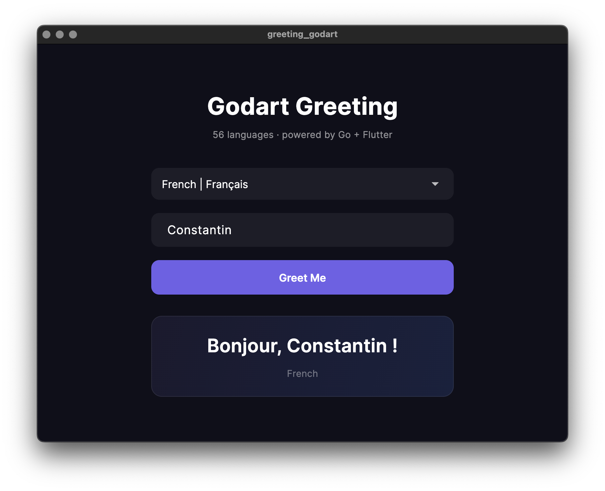

# Introducing GODART (go-dart-holons)

**The missing GUI layer for Go.** Go excels at concurrency, networking,
and systems programming — but has no native desktop or mobile UI story.
Godart bridges that gap: write your logic in Go, build your interface
in Flutter, and connect the two with gRPC over process pipes. No
bindings, no CGo glue code, no compromise.

Tooling, recipes, and documentation for building **Godart apps** —
Flutter (Dart) applications powered by an embedded Go daemon.

## What is a Godart App?

A Godart app is a Flutter application that ships with a Go backend.
The Go component runs as a headless gRPC daemon; the Flutter UI is a
pure gRPC client. The two communicate through Protocol Buffers over
an HTTP/2 channel — no FFI for data exchange.

| Platform | Transport | Go Artifact | Launch |
|----------|-----------|-------------|--------|
| **Desktop** (macOS, Linux, Windows) | `stdio://` pipes | Standalone binary | `Process.start()` |
| **Mobile** (iOS, Android) | `unix://` socket | C shared library | `dart:ffi` |

---

## Try It: Greeting Example

This SDK ships with a working example — a Go daemon that greets users
in 56 languages and a Flutter UI with a language picker. It
demonstrates the full Godart pattern: proto contract, `stdio://` gRPC
communication, and cross-platform bundling.

#### macOS

```bash
cd examples/greeting-godart
./scripts/build_daemon.sh
flutter build macos --debug
flutter run -d macos
```

#### Linux

```bash
cd examples/greeting-daemon
go build -o ../greeting-godart/build/daemon ./cmd/daemon
cd ../greeting-godart
flutter build linux --debug
cp build/daemon build/linux/x64/debug/bundle/daemon
flutter run -d linux
```

#### Windows

```powershell
cd examples\greeting-daemon
go build -o ..\greeting-godart\build\daemon.exe .\cmd\daemon
cd ..\greeting-godart
flutter build windows --debug
copy build\daemon.exe build\windows\x64\runner\Debug\daemon.exe
flutter run -d windows
```



For iOS, Android, Docker CI, and more details see **[BUILD.md](BUILD.md)**.

---

## Project Structure

```
go-dart-holons/
├── BUILD.md                     # Build & run — all platforms
├── APPS.md                      # Architecture and integration guide
├── AGENT.md                     # Agent context for AI-assisted development
├── scripts/
│   ├── build_daemon.sh          # Build Go daemon binary (desktop)
│   └── build_mobile.sh          # Build Go C shared library (mobile)
├── templates/
│   ├── xcode_build_phase.sh     # macOS: copy binary into .app bundle
│   └── proto_gen.sh             # Dual Go + Dart protoc generation
└── examples/
    ├── greeting-daemon/         # Go daemon — 56-language greeting service
    └── greeting-godart/         # Flutter app — language picker + gRPC client
```

## Documentation

| Document | Description |
|----------|-------------|
| [BUILD.md](BUILD.md) | Build & run instructions for every platform |
| [APPS.md](APPS.md) | Architecture reference — proto sharing, transport, shutdown, mobile FFI |
| [AGENT.md](AGENT.md) | Conventions and design rules for AI-assisted development |

## Related SDKs

| SDK | Role |
|-----|------|
| [go-holons](https://github.com/organic-programming/go-holons) | Go SDK — transport, serve, grpcclient, identity |
| [dart-holons](https://github.com/organic-programming/dart-holons) | Dart SDK — transport, dialStdio, grpcclient |

## Organic Programming

This SDK is part of the [Organic Programming](https://github.com/organic-programming/seed)
ecosystem.
