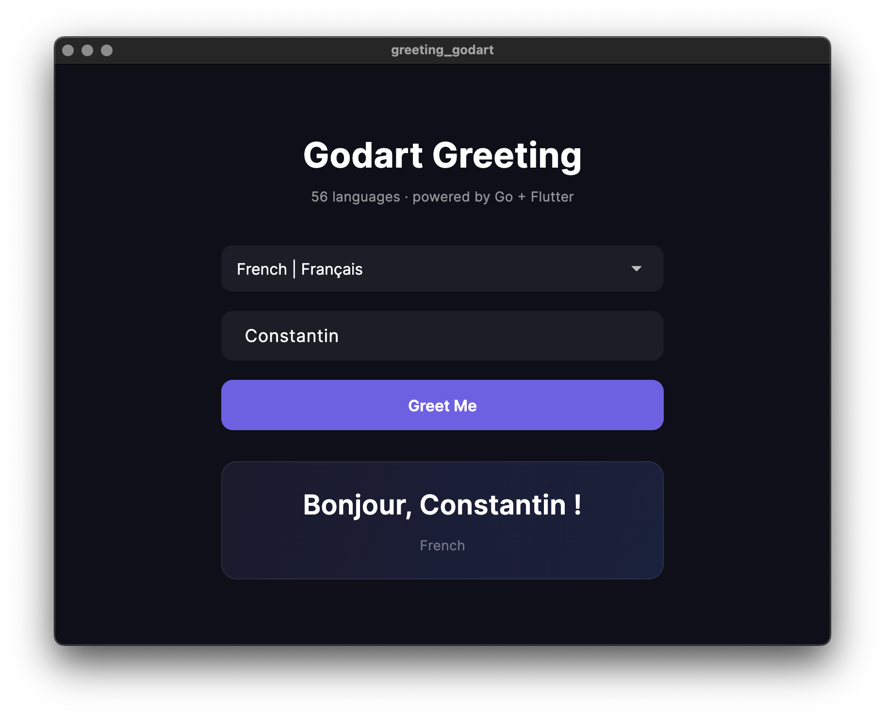

# GODART (`go-dart-holons`)

Godart is the recipe stack for composite apps with a Go backend and a
Flutter frontend.

This repository has two faces:

1. It is a toolkit for building your own composite apps: scripts,
   templates, conventions, and architecture notes.
2. It is a living showcase: `examples/greeting/` ships the full
   `Gudule Greeting Godart` holon, so you can see the pattern working
   end to end.

## Start Here

- Want to run the flagship sample now? Start with the
  [Gudule Greeting Godart README](examples/greeting/greeting-godart/README.md).
- Want platform-specific build steps? Read [BUILD.md](BUILD.md).
- Want the architecture behind the pattern? Read [APPS.md](APPS.md).
- Want the AI-agent rules that keep the stack coherent? Read
  [AGENT.md](AGENT.md).

## What Is a Godart App?

A Godart app is a Flutter application that ships with a Go backend.
The Go component runs as a headless gRPC daemon; the Flutter UI is a
gRPC client. In the current reference implementation, the desktop app
stages the bundled daemon as a local holon and lets
`dart-holons.connect("greeting-daemon-greeting-godart")` launch it on
ephemeral localhost TCP. On mobile, the daemon can also be embedded as
a shared library and reached over `unix://`.

| Platform | Transport | Go artifact | Launch |
|----------|-----------|-------------|--------|
| macOS, Linux, Windows | `connect(slug)` → `tcp://127.0.0.1:0` | Standalone binary | `dart-holons.connect()` |
| iOS, Android | `unix://` | C shared library | `dart:ffi` |

## Gudule Greeting Godart in Action

The reference implementation in this repository is
`Gudule Greeting Godart`: a Go daemon plus a Flutter UI that greets
users in 56 languages.

Source directories still use the historical names:

- `examples/greeting/greeting-daemon/`
- `examples/greeting/greeting-godart/`

But the shipped desktop artifacts are:

- `gudule-daemon-greeting-godart`
- `gudule-greeting-godart`

### Fastest Path: macOS

```bash
cd examples/greeting/greeting-godart
flutter pub get
./scripts/build_daemon.sh
flutter run -d macos
```

For Linux, Windows, iOS, Android, and CI flows, use
[BUILD.md](BUILD.md).



## Project Structure

```text
go-dart-holons/
├── README.md                    # Entry point: toolkit + showcase
├── BUILD.md                     # Build Gudule Greeting Godart, then adapt the pattern
├── APPS.md                      # Architecture and integration guide
├── AGENT.md                     # Rules for AI-assisted maintenance
├── scripts/
│   ├── build_daemon.sh          # Generic desktop daemon build helper
│   └── build_mobile.sh          # Generic mobile shared-library helper
├── templates/
│   ├── xcode_build_phase.sh     # Example macOS bundle-copy phase
│   └── proto_gen.sh             # Dual Go + Dart protoc generation
└── examples/
    └── greeting/
        ├── holon.yaml           # Composite holon manifest for Gudule Greeting Godart
        ├── greeting-daemon/     # Go daemon source
        └── greeting-godart/     # Flutter frontend source
```

## Documentation Map

| Document | Role |
|----------|------|
| [README.md](README.md) | Explains the two faces of the repository |
| [BUILD.md](BUILD.md) | Shows how to build Gudule Greeting Godart and reuse the same workflow |
| [APPS.md](APPS.md) | Explains the composite-app architecture in detail |
| [examples/greeting/greeting-godart/README.md](examples/greeting/greeting-godart/README.md) | Gudule Greeting Godart quickstart |
| [AGENT.md](AGENT.md) | Maintenance rules for agents and contributors |

## Related SDKs

| SDK | Role |
|-----|------|
| [go-holons](https://github.com/organic-programming/go-holons) | Go transport, serving, and identity |
| [dart-holons](https://github.com/organic-programming/dart-holons) | Dart transport and stdio gRPC client support |

## Organic Programming

This SDK is part of the
[Organic Programming](https://github.com/organic-programming/seed)
ecosystem.
